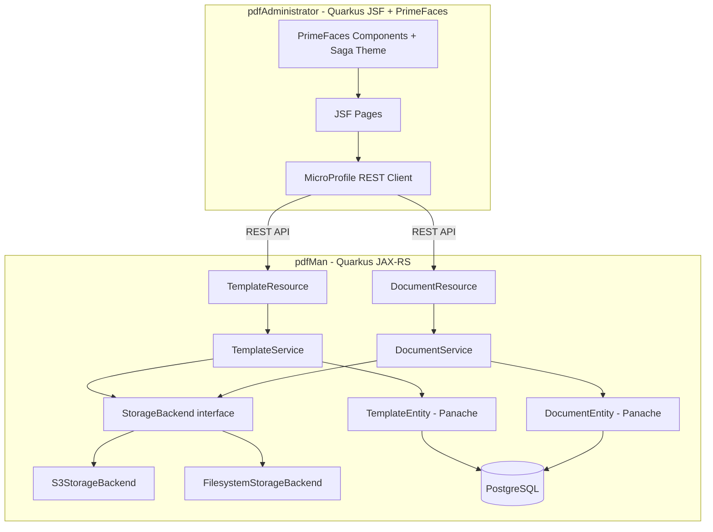

# Design Document: pdf-man-service

## Overview

The pdf-man-service consists of two Quarkus applications:

- **pdfMan** — a JAX-RS RESTful microservice exposing CRUD endpoints for PDF documents and document templates. It merges JSON data with stored templates to generate PDFs, persists metadata in PostgreSQL via Hibernate ORM with Panache, and stores binary files in a configurable Storage_Backend (AWS S3 or local filesystem).
- **pdfAdministrator** — a companion Quarkus JSF web application providing an administrative UI for template management and document listing. It uses PrimeFaces as its component library for rich UI widgets and built-in CSS theming (saga theme). It communicates exclusively with pdfMan via its REST API using MicroProfile REST Client.

Security (OIDC/JWT RBAC) is explicitly deferred to a future release. The `created_by` / `updated_by` audit fields will be populated with a placeholder value (e.g., `"system"`) until authentication is introduced.

---

## Architecture



### Key Design Decisions

1. **Templates stored as JSON in PostgreSQL** — Template content is stored as a `TEXT` column in the database, not in S3 or the filesystem. This simplifies template management and keeps templates transactional.
2. **PDF binaries in Storage_Backend** — Generated PDF files are stored in S3 or the local filesystem, selected via Quarkus configuration profiles (`%prod`, `%dev`, `%test`).
3. **StorageBackend interface** — A single `StorageBackend` CDI interface with two implementations (`S3StorageBackend`, `FilesystemStorageBackend`) selected via `@io.quarkus.arc.profile.IfBuildProfile` or `@jakarta.enterprise.inject.Alternative` + configuration. This allows tests to inject a mock without touching real storage.
4. **Panache active record** — All entities extend `PanacheEntity` and carry their own finder methods, keeping service classes thin.
5. **Flyway migrations** — Schema is managed by Flyway, applied at startup. Liquibase is an acceptable alternative but Flyway is chosen for its simpler SQL-first approach.
6. **PDF rendering** — OpenPDF (fork of iText 2) combined with Thymeleaf is used for template rendering. Thymeleaf processes the template string with the JSON payload, producing HTML, which OpenPDF converts to a PDF byte array.
7. **PrimeFaces for pdfAdministrator UI** — PrimeFaces (via the Quarkiverse Quarkus extension) provides rich JSF components (`p:dataTable`, `p:commandButton`, `p:growl`, `p:confirmDialog`) and built-in CSS theming. This eliminates the need for custom CSS stylesheets and provides a professional, consistent look out of the box with the `saga` theme. The Quarkiverse extension ensures compatibility with Quarkus build-time processing and native image compilation.

---

## Components and Interfaces

### pdfMan

#### `StorageBackend` (interface)

```java
public interface StorageBackend {
    String store(String key, byte[] data, String contentType);
    byte[] retrieve(String key);
    void delete(String key);
}
```

Implementations:
- `S3StorageBackend` — delegates to Quarkus S3 client (`software.amazon.awssdk.services.s3`)
- `FilesystemStorageBackend` — reads/writes to a configured base directory

#### `TemplateResource` — `POST/GET/PUT/DELETE /api/templates`

| Method | Path | Description |
|--------|------|-------------|
| POST | `/api/templates` | Upload new template (multipart: name + file) |
| GET | `/api/templates` | List all templates (metadata only) |
| GET | `/api/templates/{id}` | Get single template metadata + content |
| PUT | `/api/templates/{id}` | Replace template content |
| DELETE | `/api/templates/{id}` | Delete template |

#### `DocumentResource` — `POST/GET/PUT/DELETE /api/documents`

| Method | Path | Description |
|--------|------|-------------|
| POST | `/api/documents` | Generate PDF from template + JSON payload |
| GET | `/api/documents` | List all document metadata |
| GET | `/api/documents/{id}` | Download PDF binary |
| PUT | `/api/documents/{id}` | Regenerate PDF with new JSON payload |
| DELETE | `/api/documents/{id}` | Delete document |

#### `TemplateService`

Orchestrates template CRUD: validates input, calls `TemplateEntity` finders, delegates binary storage to `StorageBackend`.

#### `DocumentService`

Orchestrates document lifecycle: resolves template, invokes `PdfRenderingService`, stores PDF via `StorageBackend`, persists `DocumentEntity`.

#### `PdfRenderingService`

Accepts a template string and a `Map<String, Object>` payload. Uses Thymeleaf to render HTML, then OpenPDF to convert HTML → PDF bytes.

#### `AuditHelper`

Utility that stamps `created_at`, `created_by`, `updated_at`, `updated_by` on entities. Returns `"system"` for `*_by` fields until OIDC is introduced.

### pdfAdministrator

#### PrimeFaces Integration

The pdfAdministrator uses [PrimeFaces](https://www.primefaces.org/) as its JSF component library, providing rich UI components and built-in CSS theming. PrimeFaces is integrated via the [Quarkiverse PrimeFaces extension](https://github.com/quarkiverse/quarkus-primefaces) which handles GraalVM native-image compatibility and Quarkus build-time optimizations.

**Dependencies:**
- `io.quarkiverse.primefaces:quarkus-primefaces` — core PrimeFaces extension for Quarkus
- The extension bundles PrimeFaces and its resource handling, eliminating the need for a separate `org.primefaces:primefaces` dependency

**Theme Configuration:**
- PrimeFaces ships with three free built-in themes: `saga` (light, default), `vela` (dark), and `arya` (dark)
- The `saga` theme is used as the default for the admin UI (clean, professional light theme)
- Theme is configured via `web.xml` context parameter or Quarkus application properties:
  ```properties
  quarkus.jsf.context-parameters.primefaces.THEME=saga
  ```
- No custom CSS stylesheet (`admin.css`) is needed — PrimeFaces theme CSS provides all styling for components (tables, buttons, panels, forms, messages)

**PrimeFaces Namespace:**
All XHTML pages declare the PrimeFaces namespace:
```xml
xmlns:p="http://primefaces.org/ui"
```

#### PrimeFaces Component Mapping

The following PrimeFaces components replace standard JSF HTML components:

| Standard JSF | PrimeFaces Replacement | Usage |
|---|---|---|
| `h:dataTable` | `p:dataTable` | Template list, document list (with built-in pagination, sorting, filtering) |
| `h:commandButton` | `p:commandButton` | All action buttons (Create, Update, Delete, Refresh, Download) |
| `h:button` | `p:button` | Navigation buttons (Edit, Details, Cancel, Back) |
| `h:inputText` | `p:inputText` | Template name field |
| `h:inputTextarea` | `p:inputTextarea` | Template content editor |
| `h:messages` | `p:growl` or `p:messages` | Global error/success messages |
| `h:message` | `p:message` | Per-field validation messages |
| `h:panelGrid` | `p:panelGrid` | Document detail layout |
| `h:outputLabel` | `p:outputLabel` | Form field labels |
| `h:form` | `h:form` (unchanged) | Forms remain standard JSF |
| `h:column` | `p:column` | Table columns with sortable/filterable attributes |

#### JSF Page Structure

Each page uses a consistent PrimeFaces-themed layout:

- **`p:panel`** wraps page content with a header title
- **`p:dataTable`** provides sortable columns, pagination (`paginator="true" rows="10"`), and empty-state messages
- **`p:commandButton`** uses built-in AJAX (`ajax="true"`) with `update` attributes for partial page refresh
- **`p:growl`** displays success/error messages as toast notifications
- **`p:confirmDialog`** replaces JavaScript `confirm()` for delete confirmations

#### `PdfManClient` (MicroProfile REST Client interface)

Mirrors the pdfMan REST API. Annotated with `@RegisterRestClient`.

#### JSF Backing Beans

- `TemplateListBean` — lists templates, handles upload/delete actions
- `TemplateEditBean` — handles template edit form submission
- `DocumentListBean` — lists documents with audit trail
- `DocumentDetailBean` — shows full metadata and triggers PDF download

---

## Data Models

### Database Schema (Flyway migration `V1__init.sql`)

```sql
CREATE TABLE template (
    id          BIGSERIAL PRIMARY KEY,
    name        VARCHAR(255) NOT NULL UNIQUE,
    content     TEXT         NOT NULL,
    created_at  TIMESTAMPTZ  NOT NULL DEFAULT now(),
    updated_at  TIMESTAMPTZ,
    created_by  VARCHAR(255) NOT NULL,
    updated_by  VARCHAR(255)
);

CREATE TABLE document (
    id          BIGSERIAL PRIMARY KEY,
    template_id BIGINT       NOT NULL REFERENCES template(id),
    storage_key VARCHAR(512) NOT NULL,
    created_at  TIMESTAMPTZ  NOT NULL DEFAULT now(),
    updated_at  TIMESTAMPTZ,
    created_by  VARCHAR(255) NOT NULL,
    updated_by  VARCHAR(255)
);
```

### Panache Entities

```java
@Entity
public class TemplateEntity extends PanacheEntity {
    @Column(nullable = false, unique = true)
    public String name;

    @Column(nullable = false, columnDefinition = "TEXT")
    public String content;

    @Column(nullable = false)
    public OffsetDateTime createdAt;

    public OffsetDateTime updatedAt;

    @Column(nullable = false)
    public String createdBy;

    public String updatedBy;

    public static Optional<TemplateEntity> findByName(String name) {
        return find("name", name).firstResultOptional();
    }
}

@Entity
public class DocumentEntity extends PanacheEntity {
    @ManyToOne(optional = false)
    public TemplateEntity template;

    @Column(nullable = false)
    public String storageKey;

    @Column(nullable = false)
    public OffsetDateTime createdAt;

    public OffsetDateTime updatedAt;

    @Column(nullable = false)
    public String createdBy;

    public String updatedBy;
}
```

### REST DTOs

```java
// Template response
public record TemplateDto(
    Long id, String name, String content,
    OffsetDateTime createdAt, OffsetDateTime updatedAt,
    String createdBy, String updatedBy
) {}

// Document response
public record DocumentDto(
    Long id, Long templateId, String storageKey,
    OffsetDateTime createdAt, OffsetDateTime updatedAt,
    String createdBy, String updatedBy
) {}

// PDF generation request
public record GeneratePdfRequest(Long templateId, Map<String, Object> payload) {}
```

---

## Correctness Properties

*A property is a characteristic or behavior that should hold true across all valid executions of a system — essentially, a formal statement about what the system should do. Properties serve as the bridge between human-readable specifications and machine-verifiable correctness guarantees.*

### Property 1: Template Creation Round-Trip

*For any* valid template name and content, POSTing the template to `/api/templates` should return HTTP 201 with a body containing a non-null system-assigned `id`, and a subsequent GET to `/api/templates/{id}` should return the same name and content.

**Validates: Requirements 1.1, 1.2**

---

### Property 2: Template Creation with Missing Fields Returns 400

*For any* POST request to `/api/templates` that is missing either the template file or the template name, the system should return HTTP 400 with a non-empty error message.

**Validates: Requirements 1.3**

---

### Property 3: Duplicate Template Name Returns 409

*For any* template name, if a template with that name already exists, a second POST with the same name should return HTTP 409 with a descriptive error message.

**Validates: Requirements 1.4**

---

### Property 4: Audit Fields Present on All Created and Updated Entities

*For any* Document or Template entity, after creation the response must contain non-null `created_at` (a UTC timestamp), non-null `created_by`, and null `updated_at` / `updated_by`; after an update the response must contain non-null `updated_at` (a UTC timestamp at or after `created_at`) and non-null `updated_by`.

**Validates: Requirements 1.5, 5.3, 11.1, 11.2, 11.3, 11.4**

---

### Property 5: Template List Contains All Created Templates

*For any* set of templates created via POST, a GET to `/api/templates` should return a list whose size is at least the number of templates created, and each created template's `id` should appear in the list.

**Validates: Requirements 2.1, 2.2**

---

### Property 6: Non-Existent Resource Returns 404

*For any* identifier that was never created (or has been deleted), a GET, PUT, or DELETE request referencing that identifier should return HTTP 404 with a descriptive error message.

**Validates: Requirements 2.3, 3.4, 4.3, 5.4, 6.3, 7.4, 8.3**

---

### Property 7: Template Update Round-Trip

*For any* existing template, a PUT request with new content should return HTTP 200 with the updated content, and a subsequent GET should return the new content rather than the original.

**Validates: Requirements 3.1, 3.2, 3.3**

---

### Property 8: Template Delete Round-Trip

*For any* existing template (with no associated documents), a DELETE request should return HTTP 204, and a subsequent GET for the same `id` should return HTTP 404.

**Validates: Requirements 4.1, 4.2**

---

### Property 9: Template In-Use Delete Returns 409

*For any* template that has at least one associated Document, a DELETE request for that template should return HTTP 409 with a descriptive error message.

**Validates: Requirements 4.4**

---

### Property 10: PDF Generation Round-Trip

*For any* existing template and valid JSON payload, a POST to `/api/documents` should return HTTP 201 with a Document metadata body containing a non-null `id`, and a subsequent GET to `/api/documents/{id}` should return HTTP 200 with `Content-Type: application/pdf` and a non-empty byte body.

**Validates: Requirements 5.1, 5.2, 6.1**

---

### Property 11: Invalid Payload Returns 422

*For any* POST to `/api/documents` where the JSON payload is malformed or missing fields required by the template, the system should return HTTP 422 with a descriptive error message.

**Validates: Requirements 5.5**

---

### Property 12: Document List Contains All Generated Documents

*For any* set of documents generated via POST, a GET to `/api/documents` should return a list whose size is at least the number of documents generated, and each generated document's `id` should appear in the list.

**Validates: Requirements 6.2**

---

### Property 13: Document Update Round-Trip

*For any* existing document and a new valid JSON payload, a PUT to `/api/documents/{id}` should return HTTP 200 with updated Document metadata, and the `updated_at` field should be non-null and at or after the original `created_at`.

**Validates: Requirements 7.1, 7.2, 7.3**

---

### Property 14: Document Delete Round-Trip

*For any* existing document, a DELETE request should return HTTP 204, and a subsequent GET for the same `id` should return HTTP 404.

**Validates: Requirements 8.1, 8.2**

---

### Property 15: Storage Backend Failure Returns 503

*For any* request that triggers a storage operation (store, retrieve, or delete), if the StorageBackend throws an infrastructure exception, the system should return HTTP 503 with a descriptive error message.

**Validates: Requirements 9.4, 10.5**

---

### Property 16: DTO Serialization Round-Trip

*For any* valid `TemplateDto` or `DocumentDto` instance, serializing to JSON and then deserializing back should produce an object equal to the original (all fields preserved without data loss).

**Validates: Requirements 12.1, 12.2, 12.4**

---

## Error Handling

### HTTP Status Code Mapping

| Condition | HTTP Status |
|-----------|-------------|
| Successful creation | 201 Created |
| Successful retrieval / update | 200 OK |
| Successful deletion | 204 No Content |
| Missing required field in request | 400 Bad Request |
| Resource not found | 404 Not Found |
| Duplicate name / template in use / DB constraint violation | 409 Conflict |
| Malformed or incomplete JSON payload for PDF generation | 422 Unprocessable Entity |
| Storage backend infrastructure failure | 503 Service Unavailable |
| Database connectivity failure | 503 Service Unavailable |

### Error Response Body

All error responses return a consistent JSON body:

```json
{
  "error": "Descriptive message explaining the problem"
}
```

This is produced by a JAX-RS `ExceptionMapper` hierarchy:

- `StorageException` → 503
- `DatabaseConnectivityException` → 503
- `ConstraintViolationException` (JPA) → 409
- `NotFoundException` (custom) → 404
- `DuplicateNameException` → 409
- `TemplateInUseException` → 409
- `InvalidPayloadException` → 422
- `jakarta.validation.ConstraintViolationException` → 400

### pdfAdministrator Error Handling

The `PdfManClient` MicroProfile REST Client is wrapped in each backing bean with try/catch on `WebApplicationException`. The backing bean extracts the error message from the response body and sets it as a JSF `FacesMessage` (severity ERROR), displayed via PrimeFaces `p:growl` (toast notification) or `p:messages` component. Raw HTTP status codes are never surfaced in the UI.

When the pdfMan service is unreachable (`ProcessingException` / `ConnectException`), the backing bean sets a connectivity error message and returns the user to the current page without a blank/broken state. The `p:growl` component ensures the error is visible regardless of page scroll position.

---

## Testing Strategy

### Dual Testing Approach

Both unit tests and property-based tests are required. They are complementary:

- **Unit tests** cover specific examples, integration points, and edge cases.
- **Property-based tests** verify universal correctness properties across many generated inputs.

### pdfMan — Test Infrastructure

- **Test-scoped PostgreSQL**: Testcontainers (`quarkus-test-containers`) spins up a real PostgreSQL instance for each test class. Flyway migrations run automatically on startup.
- **Mock StorageBackend**: A `MockStorageBackend` CDI `@Alternative` bean backed by a `ConcurrentHashMap<String, byte[]>` is activated in the `test` profile. This avoids any dependency on S3 or the real filesystem.
- **Quarkus `@QuarkusTest`**: All resource endpoint tests use `@QuarkusTest` with REST-assured for HTTP-level assertions.
- **Native tests**: Each `@QuarkusTest` class has a corresponding `@QuarkusIntegrationTest` subclass (empty body) that re-runs the same tests against the native binary when the `native` profile is active.

### Property-Based Testing Library

**[jqwik](https://jqwik.net/)** is used for property-based testing on the JVM. It integrates with JUnit 5 (which Quarkus uses) and supports arbitrary generators for domain objects.

Each property test must run a minimum of **100 tries** (configured via `@Property(tries = 100)`).

Each property test must be tagged with a comment referencing the design property:

```
// Feature: pdf-man-service, Property N: <property text>
```

Each correctness property from the design document must be implemented by exactly **one** property-based test method.

### Test Class Structure

```
pdfMan/src/test/java/
  TemplateResourceTest.java          // @QuarkusTest — unit + property tests for TemplateResource
  DocumentResourceTest.java          // @QuarkusTest — unit + property tests for DocumentResource
  DtoSerializationTest.java          // jqwik property tests for DTO round-trip (Property 16)
  MockStorageBackend.java            // @Alternative CDI bean for test profile
  NativeTemplateResourceIT.java      // @QuarkusIntegrationTest — native re-run
  NativeDocumentResourceIT.java      // @QuarkusIntegrationTest — native re-run
```

### Unit Test Coverage

- All CRUD happy paths (one example each)
- All error paths (400, 404, 409, 422, 503)
- Audit field presence after create and update
- Content-Type header on PDF download

Unit tests should be kept lean — property tests handle broad input coverage.

### Property Test Coverage

Each of the 16 correctness properties maps to one `@Property` method. Generators produce:

- Random template names (alphanumeric strings, 1–100 chars)
- Random template content (valid Thymeleaf snippets or plain text)
- Random JSON payloads (maps of string keys to string/number values)
- Random non-existent IDs (large longs not present in the DB)

### pdfAdministrator Tests

- Backing bean unit tests using Mockito to mock `PdfManClient`
- Verify correct REST client methods are called for each UI action
- Verify error messages are set as `FacesMessage` on API errors (rendered by `p:growl`/`p:messages`)
- Verify connectivity error handling when `PdfManClient` throws `ProcessingException`
- PrimeFaces component rendering is NOT tested via property-based tests (UI rendering is verified manually and via integration smoke tests)

