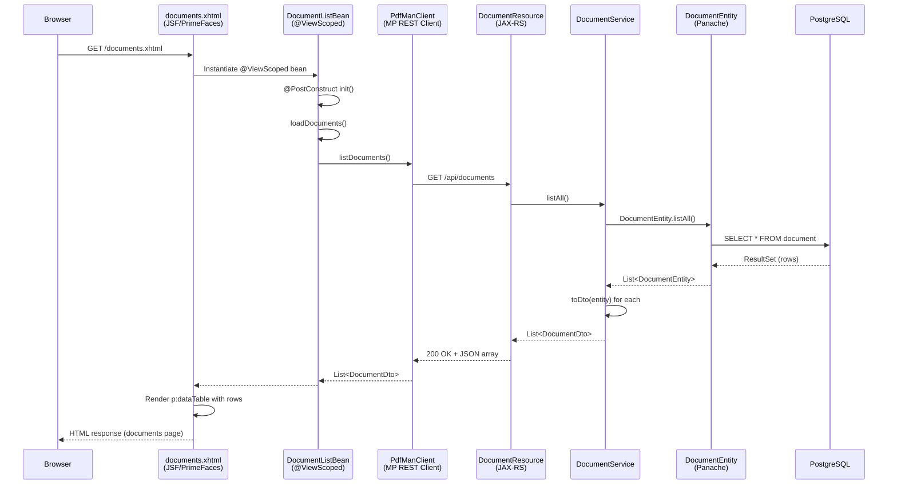

# Kiro-PDF PDF Administrator Microservices

This workspace contains two Quarkus applications that work together:

- **pdfMan** (port 8080) — JAX-RS REST microservice for template/document CRUD and PDF generation
- **pdfAdministrator** (port 8081) — JSF + PrimeFaces admin UI consuming pdfMan via MicroProfile REST Client

---

## Documents Page — Sequence Diagram

The following diagram shows the full request flow when the Documents page is loaded in pdfAdministrator, from the JSF view through to the database via pdfMan's REST API.



### Flow Description

1. **Browser → JSF**: The user navigates to `documents.xhtml`. The JSF/PrimeFaces engine processes the Facelets view.

2. **JSF → DocumentListBean**: Since the bean is `@ViewScoped`, CDI creates a new instance. The `@PostConstruct` method `init()` fires immediately.

3. **DocumentListBean → PdfManClient**: The bean calls `loadDocuments()`, which delegates to the MicroProfile REST Client interface `PdfManClient.listDocuments()`.

4. **PdfManClient → DocumentResource**: The REST Client makes an HTTP `GET /api/documents` call to the pdfMan service (port 8080).

5. **DocumentResource → DocumentService**: The JAX-RS resource method `listAll()` delegates to the CDI service.

6. **DocumentService → DocumentEntity**: The service calls Panache's `DocumentEntity.listAll()` (active record pattern).

7. **DocumentEntity → PostgreSQL**: Panache/Hibernate generates `SELECT * FROM document` and executes against the database.

8. **Response unwinds**: Results flow back through `toDto()` mapping in DocumentService, JSON serialization via Jackson in the resource, HTTP response to the REST Client, and finally the bean exposes the list to JSF's EL expression `#{documentListBean.documents}`.

9. **JSF renders**: The `<p:dataTable>` iterates over the list, rendering each document as a table row with columns for ID, Name, Description, timestamps, and action buttons.

### Error Handling

If the pdfMan service is unreachable, `DocumentListBean` catches `ProcessingException` and adds a `FacesMessage` with severity ERROR. The documents list defaults to an empty `ArrayList` so the page always renders (showing "No documents found." in the table).

---

## Getting Started

```bash
# Start pdfMan (port 8080)
cd pdfMan
./mvnw quarkus:dev

# Start pdfAdministrator (port 8081)
cd pdfAdministrator
./mvnw quarkus:dev
```

Both services require a PostgreSQL instance. In dev mode, Quarkus Dev Services automatically provisions a container.
